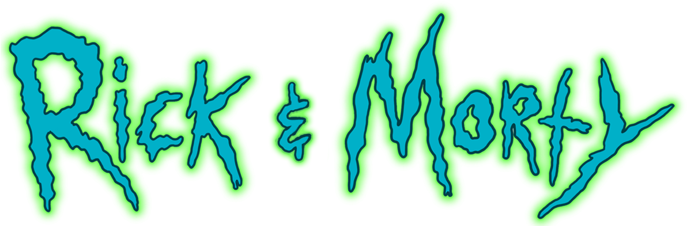

# Aplicación Rick and Morty

Una aplicación web interactiva que muestra personajes de Rick and Morty con diseño responsive, permitiendo a los usuarios buscar, ver detalles y guardar personajes favoritos.



## Características

- ✅ Visualización de personajes en grid con paginación
- ✅ Panel de detalles de personaje seleccionado
- ✅ Funcionalidad de búsqueda por nombre
- ✅ Sistema de favoritos con persistencia mediante Redux
- ✅ Diseño responsive (desktop y móvil) con experiencia optimizada para cada dispositivo
- ✅ Navegación intuitiva con indicaciones visuales claras
- ✅ Optimización de rendimiento mediante técnicas avanzadas de React

## Tecnologías utilizadas

- **Next.js 15**: Framework de React para renderizado del lado del servidor
- **React.js**: Biblioteca para interfaces de usuario
- **TypeScript**: Tipado estático para mejorar la calidad del código
- **Redux Toolkit**: Gestión de estado global eficiente
- **CSS Modules**: Estilos encapsulados por componente
- **JSON Server**: Backend mock para desarrollo local
- **Jest y React Testing Library**: Framework para pruebas unitarias

## Instrucciones para ejecutar el proyecto

### Prerrequisitos
- Node.js (v16 o superior)
- npm o yarn

### Instalación

1. Clona el repositorio:
```bash
git clone https://github.com/TU-NOMBRE-DE-USUARIO-REAL/prueba-aeromexico.git
cd prueba-aeromexico
```

2. Instala las dependencias:
```bash
npm install
# o
yarn install
```

3. Genera los datos de personajes (si el archivo db.json no existe o está vacío):
```bash
npm run update-characters
# o
yarn update-characters
```

4. Inicia el servidor de datos (mantén esta terminal abierta):
```bash
npm run server
# o
yarn server
```

5. En otra terminal, inicia la aplicación:
```bash
npm run dev
# o
yarn dev
```

5. Abre [http://localhost:3000](http://localhost:3000) en tu navegador para ver la aplicación.

## Estructura del proyecto

```
/
├── public/                # Archivos estáticos
├── src/                   # Código fuente de la aplicación
│   ├── app/               # Componente principal, estilos y pruebas de la página
│   ├── components/        # Componentes reutilizables con sus pruebas
│   ├── assets/            # Recursos estáticos (imágenes, iconos)
│   └── store/             # Configuración de Redux y slices
├── __mocks__/             # Mocks para pruebas unitarias
├── db.json                # Base de datos mock para json-server
├── jest.config.js         # Configuración de Jest
├── jest.setup.js          # Configuración adicional para tests
└── [Archivos de config]   # package.json, tsconfig.json, etc.
```

## Pruebas Unitarias

El proyecto implementa pruebas unitarias utilizando Jest y React Testing Library. Siguiendo las buenas prácticas de pruebas en componentes React, las pruebas están colocadas junto a los componentes que evalúan, facilitando su mantenimiento y relación directa con el código que prueban.

### Ubicación de las pruebas

Las pruebas están organizadas siguiendo una estructura de co-localización:

- **Pruebas de página principal**: `src/app/page.test.tsx`
- **Pruebas de componentes**: Dentro de cada directorio de componente, ejemplo: `src/components/CharacterCard/CharacterCard.test.tsx`

Esta estructura permite una relación directa entre el código y sus pruebas, facilitando el mantenimiento y mejorando la organización del proyecto.

### Ejecución de pruebas

Para ejecutar todas las pruebas unitarias:
```bash
npm run test
# o
yarn test
```

Para ejecutar pruebas con modo watch (desarrollo):
```bash
npm run test:watch
# o
yarn test:watch
```

Para ejecutar pruebas de un componente específico:
```bash
npm run test -- -t 'nombre del componente o test'
# ejemplo: npm run test -- -t 'CharacterCard'
```

### Enfoque de Testing

Las pruebas siguen un enfoque basado en comportamiento (behavior-driven), verificando:

1. **Renderizado correcto**: Los componentes se renderizan correctamente con diferentes props y estados
2. **Interacciones de usuario**: Clicks, inputs y navegación funcionan como se espera
3. **Flujo de datos**: Las actualizaciones de estado y datos funcionan correctamente
4. **Manejo de errores**: Se manejan adecuadamente casos de error y estados de carga

## Lo que más me gustó de mi desarrollo

Me enorgullece especialmente la implementación responsive de la aplicación. El esfuerzo que puse en crear una experiencia fluida tanto en dispositivos de escritorio como móviles resultó en una interfaz que se adapta perfectamente a diferentes tamaños de pantalla.

La funcionalidad de favoritos fue especialmente satisfactoria de implementar, ya que permite a los usuarios guardar y acceder rápidamente a sus personajes preferidos, con un enfoque diferente según el tipo de dispositivo. En móvil, el botón flotante con el menú emergente desde abajo crea una experiencia muy intuitiva y acorde con los patrones de diseño móvil actuales.

También disfruté optimizando el rendimiento mediante técnicas como useMemo, useCallback y carga diferida de imágenes, lo que resultó en una aplicación rápida y eficiente incluso con grandes conjuntos de datos.

## Si hubiera tenido más tiempo...

Con más tiempo, habría implementado las siguientes mejoras:

1. **Filtros adicionales**: Añadir filtros por estado, especie y ubicación para facilitar la búsqueda de personajes específicos.

2. **Paginación avanzada**: Implementar una paginación más sofisticada con carga infinita o paginación virtual para manejar grandes conjuntos de datos.

3. **Animaciones y transiciones**: Incorporar más animaciones para mejorar la experiencia del usuario, como transiciones suaves entre vistas y efectos de carga.

4. **Modo oscuro/claro**: Implementar un toggle que permita al usuario cambiar entre modo oscuro y claro según sus preferencias, persistiendo su elección.

5. **Mejora de pruebas unitarias**: Corregir las pruebas que actualmente fallan y aumentar la cobertura con más casos de prueba, especialmente para flujos complejos.

6. **PWA**: Convertir la aplicación en una Progressive Web App para permitir su uso offline y una experiencia más cercana a una aplicación nativa.

## Pain point y su solución

El problema más desafiante que enfrenté fue un error de "Maximum update depth exceeded", que ocurría debido a bucles infinitos de actualización de estado dentro de los efectos de React. Este error aparecía específicamente al utilizar la función de búsqueda y cuando se interactuaba con el dropdown de favoritos.

**Diagnóstico del problema:**
El error se producía porque había dependencias circulares en los `useEffect`. Al actualizar el estado dentro del efecto, este se volvía a ejecutar, actualizando nuevamente el estado y creando un bucle infinito. El problema se hacía evidente en modo desarrollo, pero podría haber causado problemas graves en producción.

**Solución implementada:**

1. **Separé la lógica en efectos independientes**: Dividí la lógica de filtrado de personajes y actualización del personaje seleccionado en efectos separados con responsabilidades claras y bien definidas.

2. **Optimicé las dependencias de los efectos**: Revisé cuidadosamente las dependencias de cada efecto para asegurarme de que solo se ejecutaran cuando fuera necesario, evitando actualizaciones innecesarias.

3. **Implementé useMemo para valores derivados**: Utilicé `useMemo` para estabilizar valores derivados como `favoriteCharacterIds`, evitando recálculos innecesarios que desencadenaban el bucle.

4. **Memoicé funciones con useCallback**: Todas las funciones de manejo de eventos fueron memoizadas con `useCallback` para evitar recreaciones innecesarias entre renderizados.

5. **Condicioné la ejecución de efectos**: Añadí condiciones al inicio de los efectos para evitar su ejecución innecesaria, como verificar si el dropdown está visible antes de agregar listeners de eventos.

Estas mejoras no solo solucionaron el error, sino que también mejoraron significativamente el rendimiento general de la aplicación al reducir el número de renderizaciones y actualizaciones de estado innecesarias, lo que resultó en una experiencia de usuario más fluida.

## Licencia

Este proyecto está licenciado bajo la licencia MIT.
